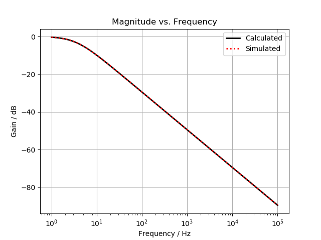
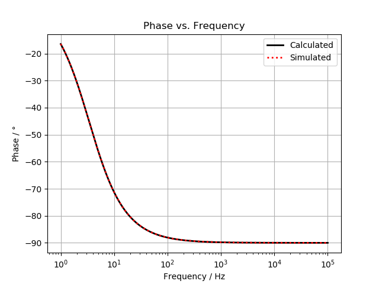

# ltspice

Disclaimer: Linear Technology is not in any way affiliated with this repository or the implemented functions.

The functions presented are intended to read an LTspice exported version of an AC analysis. The formatting from LTspice makes it challenging just reading with a regular function. By use of this script you will be able to easily compare calculations and simulations in the same window.

To use this import ltspice and use the function "ltspiceReadAC(filename)" which will return three variables: frequency, magnitude and phase (in degree).

## Examples of the ltspice interface in play

  

  

  

